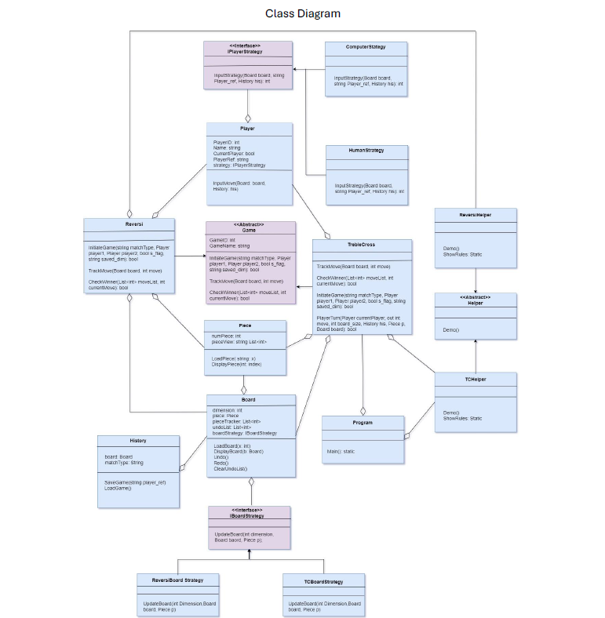
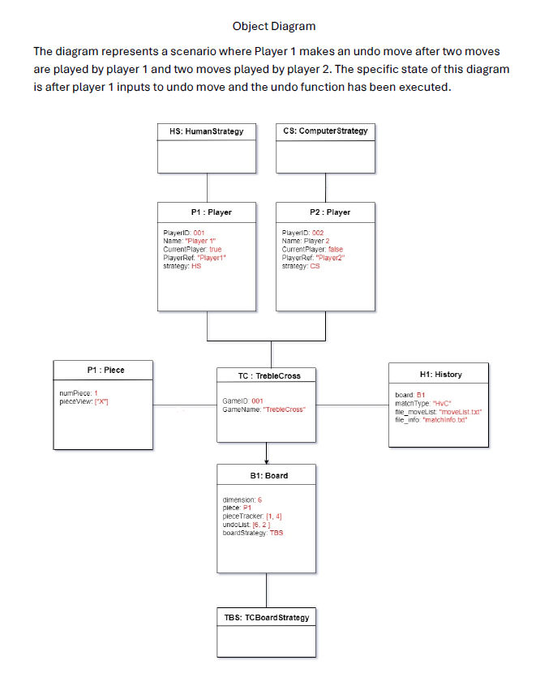

# TrebleCross
This is a simple TrebleCross game implemented using c#

In total we have 17 classes including the Program class with the main function. We didn’t create any separate classes for the menu. As all our menu operations are conducted from the main function of the Program class. Moreover, we implemented strategy patterns for both the Player and Board class for extensibility and to solve the issue of generalizing the code to be used for different games without code re-use. Thus, keeping in line with the DRY (Don’t repeat yourself) principles of software design.
We also used the template pattern with the Game class as an Abstract and the inherited classes like TrebleCross. The TrebleCross class executes all the other classes like Board, Piece, Player to run a functional game with turns. The HumanStrategy class contains all the required functions for a human player like making a valid input for a move and options to undo/redo moves by accessing the Board class. As well as to be able to save game at any valid state by calling History class.

Assumptions:

- We assumed each human player can undo moves till there are no moves to undo. And there needs to be more than one move to activate the undo function.
- The redo function only works on the same turn as undo. As otherwise the game flow is disrupted.
- Saving a game state saves the latest game state and does not save multiple game states.
- The menu only has TrebleCross as it was the only game we implemented.
- Board size was assumed to be between 5 to 20 tiles long as we decided that’s the best size for optimum game experience.
- Mid game the menu doesn’t offer to return to the main menu as there is only one game implementation at present.

## Game Architecture

